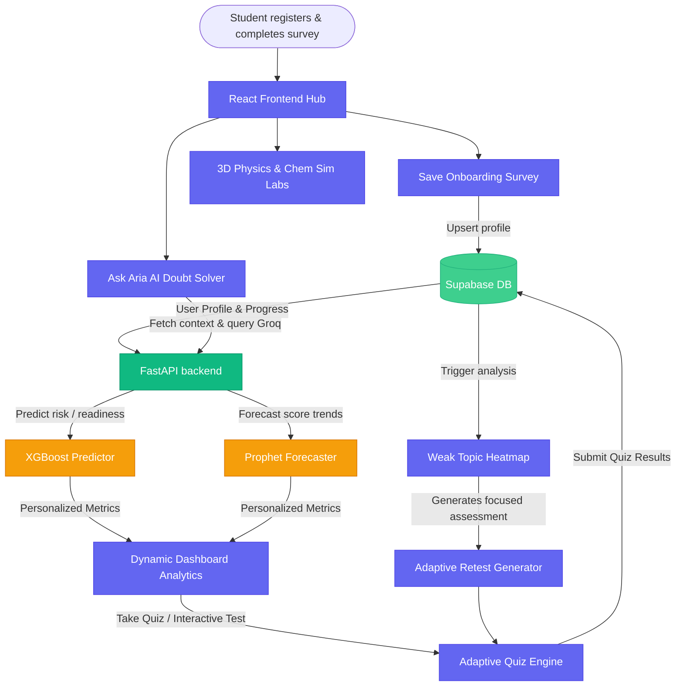

#  AI-Driven Adaptive Learning Platform

> **Transforming Competitive Exam Preparation (JEE/NEET) through Adaptive Diagnostics, 3D Simulation Labs, and Real-Time AI Remediation.**

---

[](https://vite.dev/)
[](https://react.dev/)
[](https://fastapi.tiangolo.com/)
[](https://supabase.com/)
[](https://tailwindcss.com/)
[](https://python.org/)

---

## 📖 Overview

**EduMind** is a state-of-the-art, high-fidelity AI-driven adaptive learning workspace tailored for students preparing for highly competitive entrance examinations like **JEE** and **NEET**. By combining machine learning diagnostics with interactive 3D simulations and a real-time AI doubt solver, EduMind closes the learning loop and turns mistakes into milestones.

Our platform identifies conceptual weak points through an adaptive testing suite, models student learning curves using predictive analytics, and addresses doubt resolution with an integrated AI tutor (**Ask ARIA**).

---

## 🌀 Adaptive Learning Loop Architecture

EduMind operates on a continuous feedback loop that dynamically adapts the curriculum to the student's mastery level:



---

## ✨ Key Features

### 📊 1. Weak Topic Heatmap & Predictive Diagnostics
*   **Dynamic Heatmap Grid**: Analyzes mistake records dynamically using Supabase database calls to highlight weak concept clusters.
*   **Adaptive Retest System**: Generates custom timed diagnostic assessments targeting exclusively the concepts a student struggled with in previous tests.
*   **Prophet Score Forecaster**: Models historical scores to project target score trajectories for future exam dates using **Meta Prophet**.
*   **XGBoost Performance Predictor**: Evaluates overall exam readiness percentages based on historical subject progress, accuracy rates, and time logs.

### 🔬 2. High-Fidelity 3D Simulation Labs
*   **Interactive 3D Physics Lab**: Telemetry HUD, reference frame calibration, and real-time path charting for kinematic systems (e.g., Projectile Motion, Circular Incline planes).
*   **Interactive Chemistry Lab**: Dynamic workspace to inspect molecular models, atomic structures, and chemical reaction kinetics.

### ✍️ 3. Premium Study Notes & Formula Sheets
*   **Textbook Typography**: Mathematical equations and derivations styled in custom **Lora** serif italic fonts rather than monospace coding snippets.
*   **Comprehensive LaTeX Parser**: Deep LaTeX compiler handles aligned matrices, double integrals, vector cross products ($\vec{v} = \vec{\omega} \times \vec{r}$), unit vectors ($\hat{i}$), and complex math arrays cleanly.
*   **Interactive Remediations**: Direct "Derive Formula" integrations mapping directly to our AI Assistant.

### 🤖 4. Ask ARIA: Personal AI Tutor
*   Multi-turn conversational sidekick that parses complex queries, derives steps step-by-step, and helps clarify syllabus concepts dynamically.

---

## 🛠️ Technology Stack

| Component | Technology | Description |
| :--- | :--- | :--- |
| **Frontend Core** | React.js (Vite), React Router DOM | Next-gen hot-reloading client application |
| **Animation & Graphics**| Framer Motion, Three.js / Canvas | Smooth UI transitions and interactive simulation frames |
| **Styling** | Vanilla CSS, Tailwind CSS Utility | Google Fonts (Outfit, Lora, Fira Code) for editorial math |
| **Backend API** | Python, FastAPI, Uvicorn | High-performance asynchronous REST endpoints |
| **Database & Auth** | Supabase PostgreSQL, JWT Tokens | Authentication, student profiling, and quiz analytics |
| **Machine Learning** | XGBoost, Meta Prophet | Predictive readiness grading and score forecasting |

---

## 📁 Repository Structure

```text
EduMind/
├── frontend/                  # React Vite client workspace
│   ├── src/
│   │   ├── pages/             # App views (Courses, MockTests, AskAria, Dashboard)
│   │   ├── components/        # Reusable dashboard and lab HUD blocks
│   │   ├── utils/             # Curriculum JSON structures & data sync mappings
│   │   └── index.css          # Global Tailwind configurations
│   ├── package.json
│   └── vite.config.js
│
├── backend/                   # FastAPI backend server
│   ├── routes/                # Endpoint handlers (auth, courses, doubts, tests)
│   │   ├── auth.py            # Authentication, JWT tokens, & surveys (using bcrypt)
│   │   ├── courses.py         # Course curricula, chapters, & nodes
│   │   ├── doubts.py          # AI Tutor (Aria) query processor
│   │   ├── tests.py           # Diagnostic assessments & adaptive retests
│   │   └── ml.py              # XGBoost & Prophet execution endpoints
│   ├── schemas/               # Request & Response validation models (Pydantic)
│   ├── ml/                    # Machine learning models & prediction pipelines
│   ├── weights/               # Trained model files (.json, .pkl)
│   ├── main.py                # Server entrypoint
│   ├── database.py            # Supabase database client initialization
│   ├── sync_to_frontend.py    # Offline cache sync utility script
│   └── sanitize_caches.py     # LaTeX data repair and sanitization script
```

---

## ⚡ Setup & Installation

### Prerequisite Setup
Ensure you have the following installed:
*   Node.js (v18+)
*   Python (v3.10+)
*   Supabase account & database

---

### 1. Backend Server Configuration

1.  Navigate to the backend directory:
    ```bash
    cd backend
    ```
2.  Create and activate a Python virtual environment:
    ```bash
    python -m venv venv
    # On Windows:
    venv\Scripts\activate
    # On macOS/Linux:
    source venv/bin/activate
    ```
3.  Install the required dependencies:
    ```bash
    pip install fastapi uvicorn supabase xgboost prophet pydantic bcrypt pyjwt python-dotenv
    ```
4.  Create a `.env` configuration file in `backend/`:
    ```env
    SUPABASE_URL=your_supabase_url
    SUPABASE_KEY=your_supabase_service_role_key
    GROQ_API_KEY=your_groq_api_key
    JWT_SECRET=your_jwt_signing_secret
    ```
5.  Run the DB/Caches sanitization and sync script:
    ```bash
    python sanitize_caches.py
    python sync_to_frontend.py
    ```
6.  Start the development server:
    ```bash
    uvicorn main:app --reload
    ```
    The backend API will run at `http://localhost:8000`.

---

### 2. Frontend Client Configuration

1.  Navigate to the frontend directory:
    ```bash
    cd ../frontend
    ```
2.  Install the required Node packages:
    ```bash
    npm install
    ```
3.  Create a `.env` file in `frontend/` containing API endpoints:
    ```env
    VITE_API_URL=http://localhost:8000
    VITE_SUPABASE_URL=your_supabase_url
    VITE_SUPABASE_ANON_KEY=your_supabase_anon_key
    ```
4.  Start the Vite hot-reloading development server:
    ```bash
    npm run dev
    ```
    Open `http://localhost:5173` in your browser.

---

## 🧪 Math & LaTeX Formatting Guidelines
Our custom LaTeX parser translates mathematical strings into readable unicode variables dynamically. If adding or editing caches:
*   Avoid raw unescaped slash characters that cause escape collisions in JSON parsers.
*   Use `\\theta` (double backslashes) instead of `\theta` (single backslashes) inside caches.
*   Use standard fractional formats: `\\frac{Numerator}{Denominator}`.
*   To display vectors, wrap variables in `\\vec{r}` or `\\overrightarrow{v}`.
