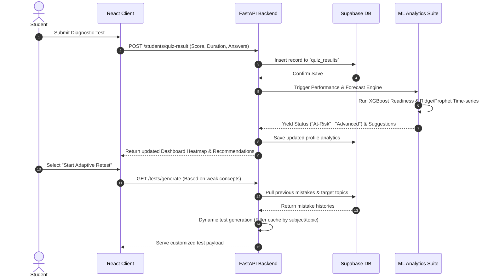
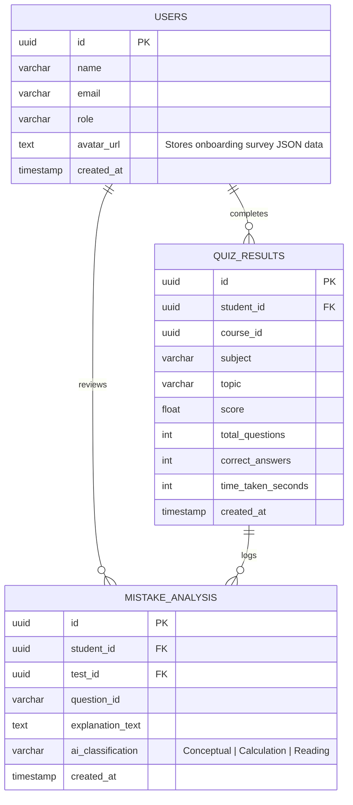

#  AI-Driven Adaptive Learning Platform

> **Closing the Loop on Competitive Entrance Prep (JEE/NEET) with Predictive Machine Learning, 3D Simulation Labs, and Real-Time LaTeX Remediation.**

---

<p align="center">
  <a href="#-key-architectural-flows">Architectural Flows</a> •
  <a href="#-feature-deep-dives">Feature Deep Dives</a> •
  <a href="#-ml-predictive-pipelines">ML Pipelines</a> •
  <a href="#-supabase-database-schema">Database Schema</a> •
  <a href="#-setup--installation">Setup & Installation</a> •
  <a href="#-latex-formatting-system">LaTeX Formatting</a> •
  <a href="#-project-roadmap">Roadmap</a>
</p>

---

<p align="center">
  
  
  
  
  
  
</p>

---

## 📖 Overview

**EduMind** is a state-of-the-art, high-fidelity AI-driven adaptive learning workspace designed for students preparing for high-stakes examinations like **JEE** and **NEET**. Traditional study tools fail to bridge the gap between *diagnosing a student's mistakes* and *providing immediate conceptual, spatial, and mathematical clarity*. 

EduMind bridges this gap by integrating:
1.  **Time-Series Score Forecasting** and **Risk Profiling** via Meta Prophet & XGBoost.
2.  **3D Interactive Labs** that render real-time physical and chemical simulations.
3.  **An AI Tutor (Ask ARIA)** built directly into textbook formulas, offering step-by-step mathematical derivations.
4.  **A Robust LaTeX Engine** that normalizes mathematical notation across Web interfaces.

---

## 🌀 Key Architectural Flows

### 1. High-Level Data Flow
This diagram details the operational stack, showing how student interactions on the React client trigger database events, which then feed back into the ML pipeline and cache generator.


### 2. Adaptive Assessment Cycle (Sequence Flow)
The sequence of events from when a student submits an exam, gets diagnosed by the ML module, and receives an adaptive remedial test:



---

## ⚡ Feature Deep Dives

### 1. 📊 Weak Topic Heatmap & Predictive Diagnostics
*   **The Problem:** Students often waste time practicing topics they have already mastered, or remain unaware of concept gaps.
*   **Our Solution:** Every time a test is submitted, the backend logs accuracy rates against specific sub-topics. The frontend displays this as a **colored matrix (Heatmap)** showing concept mastery.
*   **Adaptive Retesting:** Clicking a weak node on the heatmap generates an **Adaptive Retest** that extracts questions from the curriculum cache matching only those sub-topics.

> [!TIP]
> **Performance Tip:** Adaptive retests prioritize questions associated with high-frequency mistake codes (e.g., calculation error vs. conceptual gap) logged in the database.

---

### 2. 🔬 High-Fidelity 3D Simulation Labs
*   **Interactive 3D Physics Lab:** Renders dynamic systems (rotational incline plates, projectile launchers). Includes reference frame selectors and path tracing.
*   **Interactive Chemistry Lab:** Structural visualization workspace for molecular configuration, stoichiometry, and reaction mechanics.

#### Kinematics Simulator Numerical Solver
The physics simulator resolves physical kinematics step-by-step using Euler Integration. The formulas handled by the telemetry engine include:

$$ \theta = \frac{s}{r} \quad (\text{Angular Displacement}) $$

$$ \omega = \frac{d\theta}{dt} \quad (\text{Angular Velocity}) $$

$$ v = r \cdot \omega \quad (\text{Linear Velocity}) $$

$$ \alpha = \frac{d\omega}{dt} = \frac{d^2\theta}{dt^2} = \frac{\tau}{I} \quad (\text{Angular Acceleration}) $$

---

### 3. 🤖 Ask ARIA: Personal AI Tutor
*   An LLM assistant that uses context-aware prompting.
*   **Inline Derivations:** Clicking "Derive Formula" in study guides transfers the LaTeX formula code block directly to ARIA, which displays the step-by-step proof.

---

## 🧠 ML Predictive Pipelines

EduMind implements two distinct ML modules to evaluate progress and forecast readiness:

### 1. XGBoost Performance Predictor (`ml/performance.py`)
Predicts a student's status: **At-Risk**, **On-Track**, or **Advanced**, alongside a calculated probability score.
*   **Input Features:** Average Test Score ($S$), Weekly Study Hours ($H$), Total Doubts Asked ($D$), Quizzes Completed ($Q$), and Daily Active Streak ($K$).
*   **Model Architecture:** Multi-class classification using an ensemble gradient boosted decision tree (XGBoost).
*   **Fallback Handler:** If weights are missing, the system defaults to a rule-based educational heuristic:
    *   $S < 55.0$ or $H < 5.0 \implies \text{At-Risk}$
    *   $S \ge 80.0 \implies \text{Advanced}$
    *   Otherwise $\implies \text{On-Track}$

### 2. Prophet Time-Series Forecaster (`ml/forecaster.py`)
Forecasts student score trends over the next 30 days.
*   **Input:** Historical test scores sorted chronologically.
*   **Logic:** Fits a Ridge Regression model (or Meta Prophet time-series) capturing linear study progression combined with **weekly seasonality** ($7$-day period fluctuation modeled as a sine wave):
    
    $$ P(d) = S_0 + (T \cdot d) + 3.0 \cdot \sin\left(\frac{2\pi \cdot d}{7}\right) $$
    
    *   $P(d)$ = Predicted score at day $d$
    *   $S_0$ = Last recorded score
    *   $T$ = Student learning trend slope
    *   $3.0 \cdot \sin(\dots)$ = Periodic energy/fatigue oscillation
*   **Uncertainty Boundaries:** The system calculates upper and lower confidence intervals that widen over time to reflect increasing forecast uncertainty:
    
    $$ \text{Uncertainty} = 3.0 + (d \cdot 0.25) $$

---

## 🗄️ Supabase Database Schema

The platform relies on the following schema architecture inside Supabase:



---

## ⚡ Setup & Installation

### Prerequisite Checklist
- **Node.js** (v18.0.0+)
- **Python** (v3.10.0+ to v3.12.0)
- **Supabase Account** with an active PostgreSQL instance.

### 1. Environment Configuration

Create a `.env` file in the `backend/` directory:
```env
SUPABASE_URL="https://your-project-id.supabase.co"
SUPABASE_KEY="your-supabase-service-role-key"
GROQ_API_KEY="gsk_your-groq-api-key"
SECRET_KEY="your-jwt-signing-secret"
```

Create a `.env` file in the `frontend/` directory:
```env
VITE_API_URL="http://localhost:8000"
VITE_SUPABASE_URL="https://your-project-id.supabase.co"
VITE_SUPABASE_ANON_KEY="your-supabase-anon-key"
```

### 2. Backend Installation & Service Spin-up
1.  Navigate to the backend folder:
    ```bash
    cd backend
    ```
2.  Set up and activate a local virtual environment:
    ```bash
    python -m venv venv
    # Windows
    venv\Scripts\activate
    # macOS/Linux
    source venv/bin/activate
    ```
3.  Install dependencies:
    ```bash
    pip install fastapi uvicorn supabase xgboost prophet pydantic bcrypt pyjwt python-dotenv pandas scikit-learn
    ```
4.  Run the synchronization and sanitization scripts:
    ```bash
    # Normalizes LaTeX cache structures
    python sanitize_caches.py
    # Syncs curriculum data with frontend static folders
    python sync_to_frontend.py
    # Generates initial ML weights
    python train_models.py
    ```
5.  Start the FastAPI server:
    ```bash
    uvicorn main:app --reload
    ```
    API documentation is available at `http://localhost:8000/docs`.

### 3. Frontend Installation
1.  Navigate to the frontend folder:
    ```bash
    cd ../frontend
    ```
2.  Install packages:
    ```bash
    npm install
    ```
3.  Launch the development build:
    ```bash
    npm run dev
    ```
    The application will run at `http://localhost:5173`.

---

## 🧪 LaTeX Formatting System

### Escape Collision Avoidance
JSON parsers convert backslashes (e.g. `\t`, `\n`) into control characters. In the curriculum JSON files, this would break formulas like `\theta` (read as a tab `\t` + `heta`).

Our backend uses `sanitize_caches.py` to fix escaping:
*   Converts control sequences back to double backslashes before processing:
    ```python
    content = content.replace("\t", "\\t").replace("\f", "\\f").replace("\r", "\\r")
    ```
*   Ensures all LaTeX statements use double backslashes (`\\theta`, `\\omega`, `\\frac{a}{b}`) inside JSON caches.

### The React Cleaner Pattern
On the client side, components like `Courses.jsx` and `MockTests.jsx` clean incoming text strings using regex before rendering them:
```javascript
export const cleanMathLaTeX = (text) => {
  if (!text) return "";
  let clean = text;
  // Restore escaped control patterns
  clean = clean.replace(/\t/g, "\\t").replace(/\f/g, "\\f");
  // Wrap raw mathematical expressions in inline math blocks ($)
  // for KaTeX parser rendering
  return clean;
};
```

---

## 🗺️ Project Roadmap

- [x] **Core Backend Services**: FastAPI endpoints, authentication, JWT tokens, Supabase database integration.
- [x] **Direct Bcrypt Transition**: Replaced broken `passlib` context setup with a clean, native `bcrypt` interface.
- [x] **Syllabus & Curriculum Cache Sanitizer**: Solved raw escape formatting conflicts in JSON data.
- [x] **3D Kinematics and Chemistry Labs**: Real-time HUD integration.
- [ ] **Real-Time Multiplayer Lab Arena**: Share simulation screens via WebRTC.
- [ ] **Voice-Enabled Ask ARIA**: Vocal input and speech synthesis for explanations.
