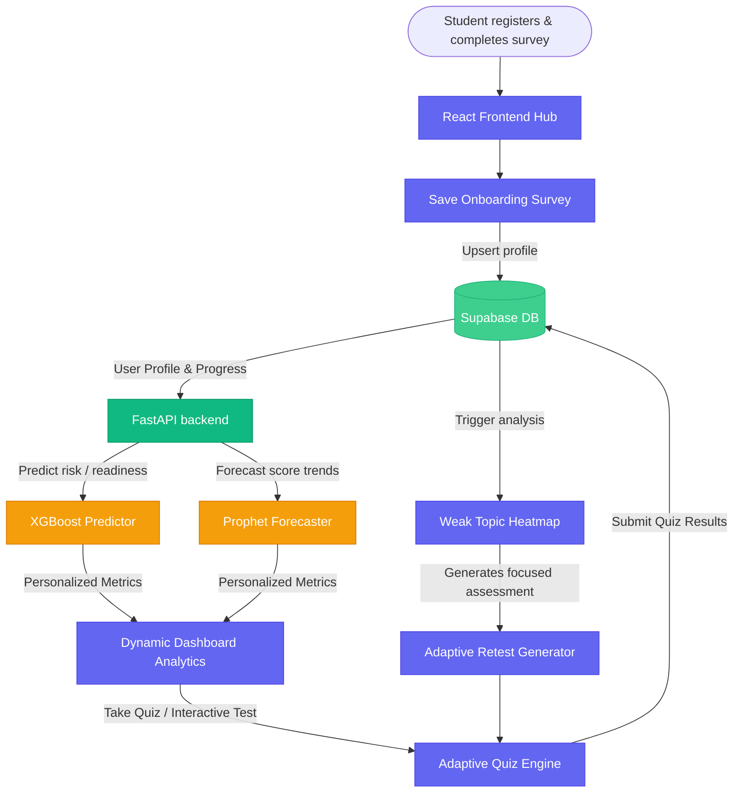
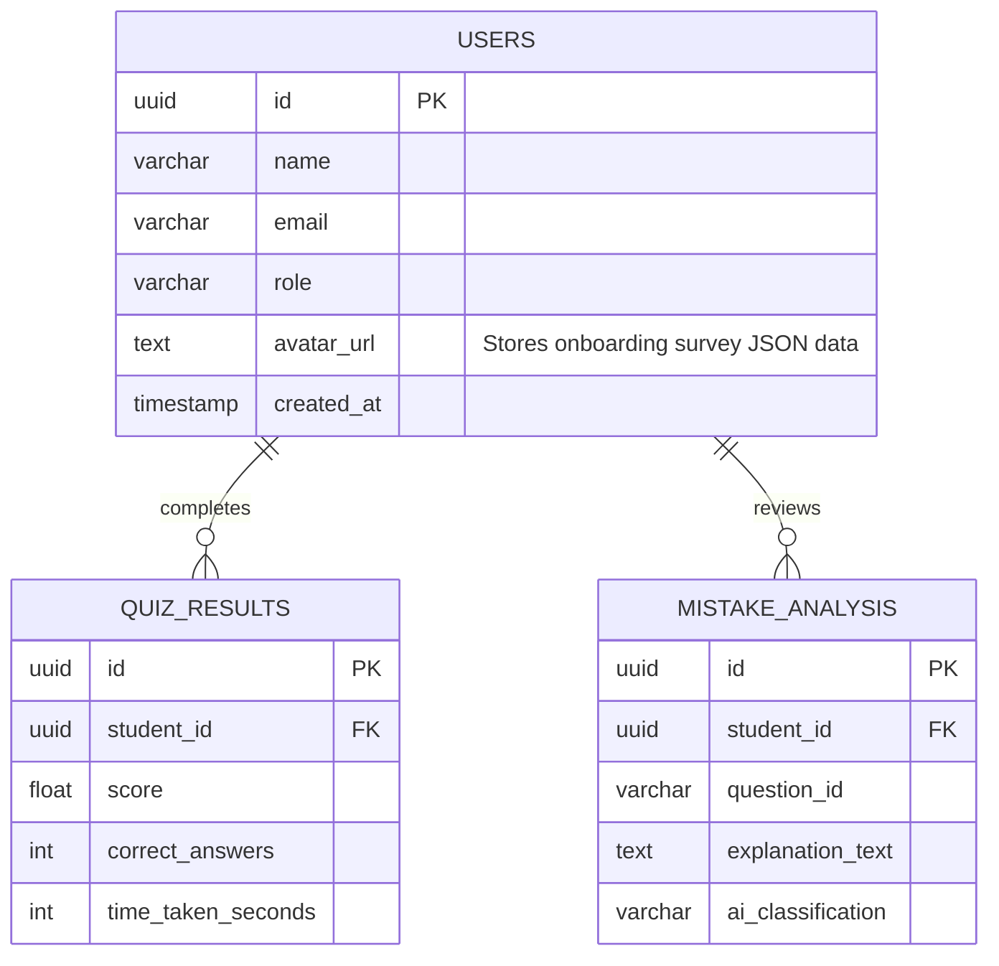

<div align="center">

# 🚀 EduMind: The Ultimate AI-Powered Adaptive Learning Ecosystem

**Closing the Loop on Competitive Entrance Prep (JEE/NEET) with Predictive Machine Learning, Interactive 3D Simulation Labs, and Real-Time LaTeX Remediation.**

[](https://vitejs.dev/)
[](https://reactjs.org/)
[](https://fastapi.tiangolo.com/)
[](https://supabase.com/)
[](https://tailwindcss.com/)
[](https://python.org/)

[Features](#-key-features) • [Architecture](#-architecture--ml-pipelines) • [Installation](#-quick-start) • [Roadmap](#-roadmap) • [Contributing](#-contributing)

</div>

---

## 🌟 The Vision

**EduMind** is a state-of-the-art, high-fidelity AI-driven adaptive learning workspace designed for students preparing for high-stakes examinations like **JEE** and **NEET**. Traditional study tools fail to bridge the gap between *diagnosing a student's mistakes* and *providing immediate conceptual, spatial, and mathematical clarity*. 

EduMind redefines educational technology by integrating machine learning, spatial 3D simulations, and context-aware LLMs into a seamless, blazing-fast learning hub.

---

## 🔥 Key Features

| Feature | Description | Highlight |
|---------|-------------|-----------|
| 📈 **Predictive Analytics** | Time-series score forecasting & risk profiling | Uses **Meta Prophet** & **XGBoost** to accurately predict learning trajectories. |
| 🔬 **3D Interactive Labs** | Real-time, interactive physics and chemistry simulations | Powered by **Three.js**, visualize rotational kinematics or stereochemistry organically. |
| 🤖 **Ask ARIA (AI Tutor)** | Context-aware, built-in intelligent tutoring system | Analyzes formulas and outputs step-by-step proofs dynamically. |
| ✍️ **Robust LaTeX Engine** | Flawless mathematical rendering on the web | Zero escape collisions, ensuring perfect normalization of $y = mx+b$ and complex calculus. |

---

## 🏗️ Architecture & ML Pipelines

### Flow Diagram



### Machine Learning Modules

1. **XGBoost Performance Predictor (`ml/performance.py`)**
   Predicts readiness categories (**At-Risk**, **On-Track**, **Advanced**) based on average test scores, weekly study hours, doubt requests, quiz counts, and daily active streaks.
   
2. **Prophet Time-Series Forecaster (`ml/forecaster.py`)**
   Projects a student’s score trend up to 30 days ahead using Ridge Regression with built-in seasonal adjustments (weekly fatigue/energy cycles).

---

## 🗄️ Supabase Schema Topology

The backbone of EduMind connects user profiles with their performance vectors for seamless data mining.



---

## 🚀 Quick Start

### 1. Prerequisites
- **Node.js** (v18+)
- **Python** (v3.10+)
- **Supabase Account**
- **Groq API Key** (For ARIA LLM)

### 2. Environment Variables

**`backend/.env`**
```env
SUPABASE_URL="https://your-project-id.supabase.co"
SUPABASE_KEY="your-service-role-key"
GROQ_API_KEY="gsk_your_api_key"
SECRET_KEY="secure-jwt-signing-key"
```

**`frontend/.env`**
```env
VITE_API_URL="http://localhost:8000"
VITE_SUPABASE_URL="https://your-project-id.supabase.co"
VITE_SUPABASE_ANON_KEY="your-anon-key"
```

### 3. Backend Setup

```bash
cd backend
python -m venv venv
venv\Scripts\activate   # Or source venv/bin/activate on macOS/Linux
pip install -r requirements.txt

# Run initial generation scripts
python sanitize_caches.py
python sync_to_frontend.py
python train_models.py

# Launch FastAPI Server
uvicorn main:app --reload
```
*API Docs available at `http://localhost:8000/docs`*

### 4. Frontend Setup

```bash
cd frontend
npm install
npm run dev
```
*Platform boots at `http://localhost:5173`*

---

## 🗺️ Roadmap

- [x] **Core Backend Services**: Secured JWT FastApi endpoints, robust Supabase integration.
- [x] **Production Grade Resiliency**: Try-catch fallbacks for external dependencies (Groq/Supabase).
- [x] **3D Kinematics and Chemistry Labs**: Real-time HUD and rendering optimizations.
- [x] **Bcrypt Security Audit**: Native hash validation integrated globally.
- [ ] **Multiplayer WebRTC Sessions**: Allow students to join the same 3D workspace.
- [ ] **Voice-Enabled ARIA**: Transcribe vocal input to trigger intelligent science tutoring.

---

<div align="center">
Made with ❤️ by the EduMind Team.
</div>
